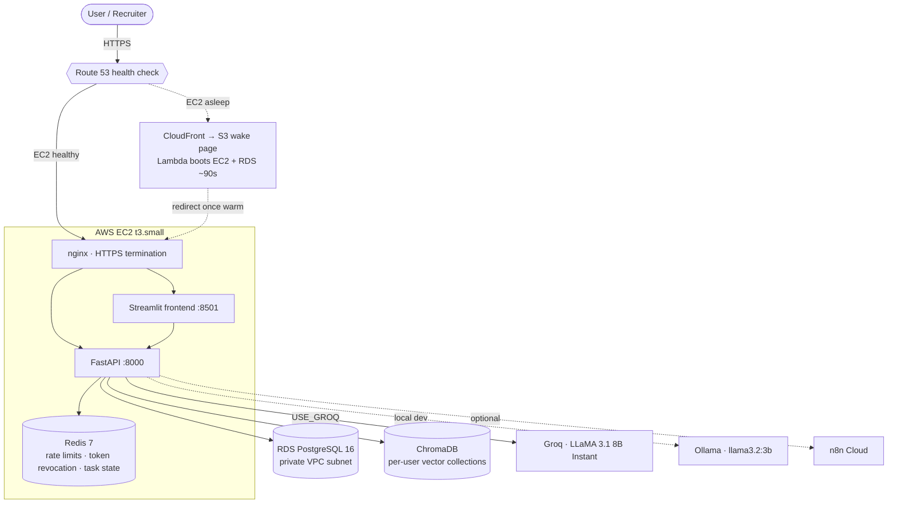
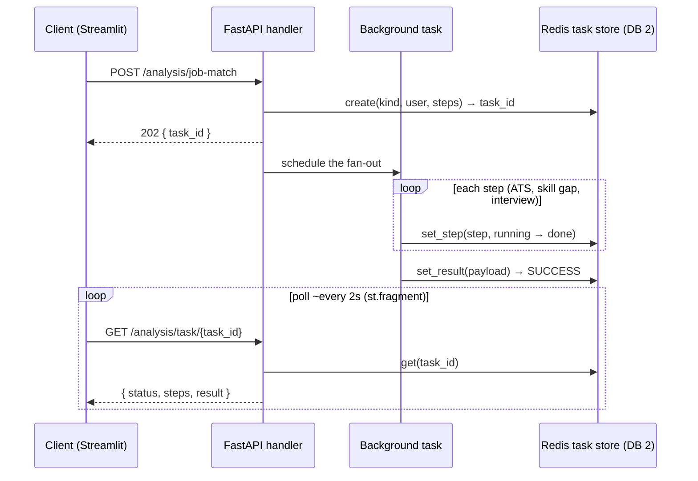
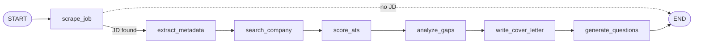
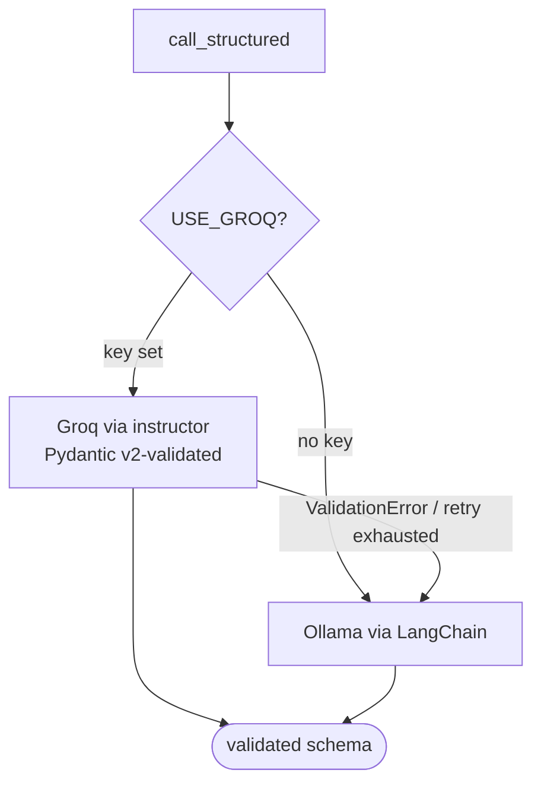
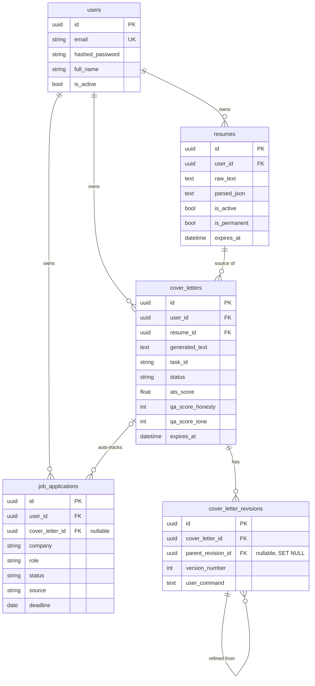

# Architecture

AI Career Hub is a production-deployed FastAPI + Streamlit application that turns a resume and a job
posting into an honest, evidence-grounded application package — an ATS score, a cover letter, a skill-gap
plan, and interview questions — with an agentic pipeline that can do all of it from a single job URL.

This document covers the system topology, the request models (synchronous and async), the agentic
pipeline, the dual-path LLM design, the retrieval layer, and the data model. For the "why" behind the
load-bearing choices, see the [Architecture Decision Records](./adr/).

---

## System context

The application is a single EC2 instance running the stack under Docker Compose behind nginx, with
PostgreSQL on RDS in a private subnet. To control cost, the instance runs during business hours and
otherwise sleeps; a Route 53 health check fails over to a CloudFront/S3 wake page that boots the instance
on visit (~90s cold start). Infrastructure detail lives in [INFRASTRUCTURE.md](../INFRASTRUCTURE.md).

---

## Request models

### Synchronous requests

Most endpoints are ordinary `async def` handlers: validate the request with a Pydantic/SQLModel schema,
do the work against the async database session, return a typed response. All database I/O is async and
parameterised; ORM tables are never returned raw — a response schema always sits in between.

### Asynchronous work: 202 + poll

Anything that calls an LLM more than once — cover-letter generation, combined job-match analysis, and the
agentic pipeline — is too slow to hold a request open and must survive the user navigating away. These
endpoints accept the work, return **`202 Accepted`** with a `task_id`, run in the background, and publish
progress to a Redis-backed task store the client polls.

The task store (`services/task_state.py`) is deliberately shaped:

- **One Redis hash per task**, with **one field per step** (`step:<name>`). Parallel workers each flip
  their own step, so there is no read-modify-write race on a shared JSON blob.
- **Statuses** progress `PENDING → STARTED → SUCCESS | FAILURE`; the result payload is stored as JSON on
  completion. A one-hour TTL comfortably outlives any polling session.
- **Two clients.** The async client serves request handlers; a **sync** client serves threadpool writers,
  because FastAPI `BackgroundTasks` run sync functions in worker threads and the async client is bound to
  the event loop. Both are lazily initialised.
- **Degrade to inline.** If Redis can't take the task (`create` returns `None`), the caller runs the work
  inline and returns a normal `200` — the feature still works, it just loses live progress.

A poll for an unknown or expired `task_id` returns `404` (honest "lost"), and a store error surfaces as
`503` rather than a misleading `PENDING`.

---

## The agentic pipeline

The agent (`services/agent_graph.py`) is a compiled **LangGraph** state graph: one job URL drives a
seven-step pipeline, each step a tool node that reads and writes a shared, typed `AgentState`.

Design points:

- **Typed accumulating state.** `AgentState` is a `TypedDict`; `steps_completed` and `errors` use an
  `operator.add` reducer, so each node *appends* its record rather than overwriting — the full execution
  trace assembles itself.
- **Fail-soft.** If scraping yields no job description, a conditional edge ends the run early. Every other
  node captures its own exception into `errors` and execution continues, so one flaky step never aborts
  the pipeline. The run is reported as `completed`, `partial`, or `failed`.
- **Streaming for progress.** `run_agent` iterates `graph.stream(stream_mode="values")` instead of a
  single `invoke()`. The final state is identical, but each completed node yields once, and an optional
  `on_step` callback turns those yields into the live step checklist the UI renders.
- The compiled graph is a module singleton, built once on first use.

---

## Dual-path LLM

Every LLM feature has two execution paths, selected by the computed `USE_GROQ` flag.

- **Production (Groq).** `call_structured()` uses `instructor` to coerce the model's output into a Pydantic
  schema from `services/llm_schemas.py`, retrying on validation failure. Application code only ever sees
  validated data — no regex parsing, no hallucinated fields reaching the database.
- **Local dev (Ollama).** A LangChain path provides unstructured generation with no cloud dependency, and
  also serves as the fallback when the instructor path fails validation.
- **Rate-limit resilience.** `call_structured` backs off on provider `429`s with capped exponential retry
  (honouring `Retry-After`) and then raises a typed `LLMRateLimitedError`. That error deliberately does
  **not** trigger the Ollama fallback — in production it would just bury an honest "model busy" signal.
- **Injection guard.** User-supplied job-description text runs through `_sanitize_jd_for_prompt()` before
  any prompt is built, on both the local and n8n dispatch paths.

---

## ATS scoring

The scorer (`services/ats_scorer.py`) is a hybrid model, not keyword-only:

| Signal | Weight | What it measures |
|---|--:|---|
| Semantic | 50% | `all-MiniLM-L6-v2` cosine similarity (whole-document and per-section) — catches synonyms a keyword scan misses |
| Keyword | 30% | Exact matches, bigrams, and a priority-keyword bonus, after boilerplate stripping |
| Structure | 20% | Section-presence heuristics (experience, education, skills…) |

The sentence-transformers model (~80 MB) is loaded **once** via `@lru_cache` and shared with the embedding
service, so the whole process holds a single copy in memory.

---

## Retrieval (RAG)

The embedding service (`services/embedding_service.py`) maintains a **persistent per-user ChromaDB
collection**. Resumes are chunked (≈400 chars / 60 overlap) and embedded on upload; cover letters and job
descriptions are indexed after generation. Retrieval is cosine-similarity search, and the service falls
back to an ephemeral FAISS index if ChromaDB is unavailable. It reuses the same `all-MiniLM-L6-v2`
singleton as the ATS scorer.

---

## Data model

Notes:

- **UUID primary keys** throughout, and every owned row carries an indexed `user_id` foreign key — the
  natural boundary for per-user isolation.
- **Revision lineage is an adjacency list.** `cover_letter_revisions.parent_revision_id` is a nullable
  self-reference (`ON DELETE SET NULL`): `NULL` means "refined from the active letter", and a non-null
  value points at the revision a branch was forked from. Version numbers stay a single flat sequence;
  lineage is a tree layered on top. See [ADR-0005](./adr/0005-refine-lineage-adjacency-list.md).
- **The tracker auto-populates.** Generating a cover letter creates a `wishlist` job application
  (`source = "auto"`); the `cover_letter_id` foreign key is `ON DELETE SET NULL` so deleting a letter
  never deletes its tracked application.
- Schema changes are versioned with Alembic and applied automatically on boot in production.

---

## Where things live

| Concern | Module |
|---|---|
| App wiring, lifespan, middleware, health | `app/main.py` |
| Routers | `app/api/v1/` |
| Settings | `app/core/config.py` |
| Async task store | `app/services/task_state.py` |
| Agentic pipeline | `app/services/agent_graph.py` · `agent_tools.py` |
| LLM client (dual-path) | `app/services/llm_client.py` · `llm_schemas.py` |
| ATS scoring | `app/services/ats_scorer.py` |
| Retrieval | `app/services/embedding_service.py` |

See the [API reference](./API.md) for the endpoint surface and [SECURITY.md](../SECURITY.md) for the
security posture.
